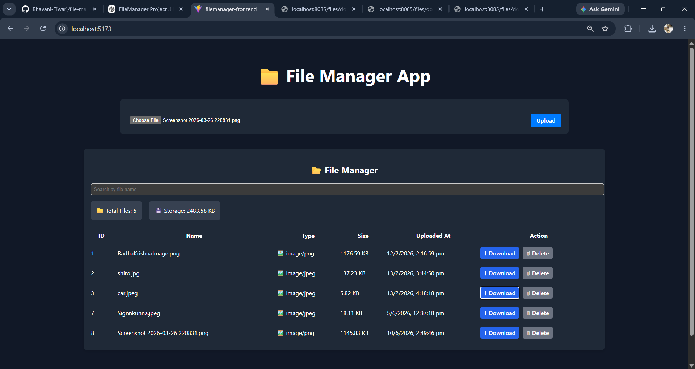
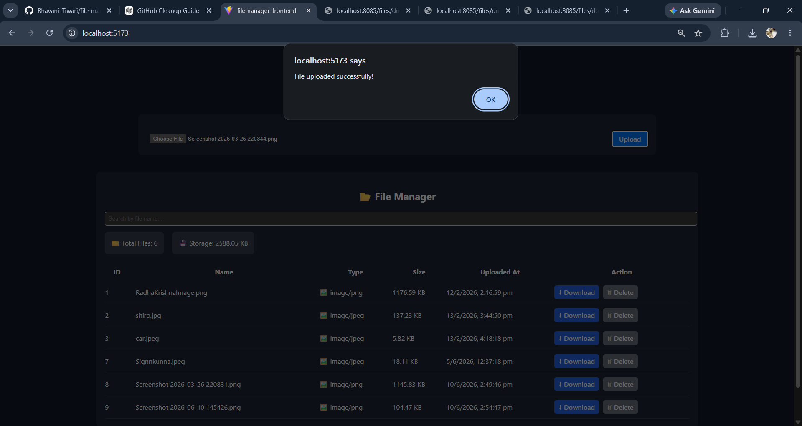
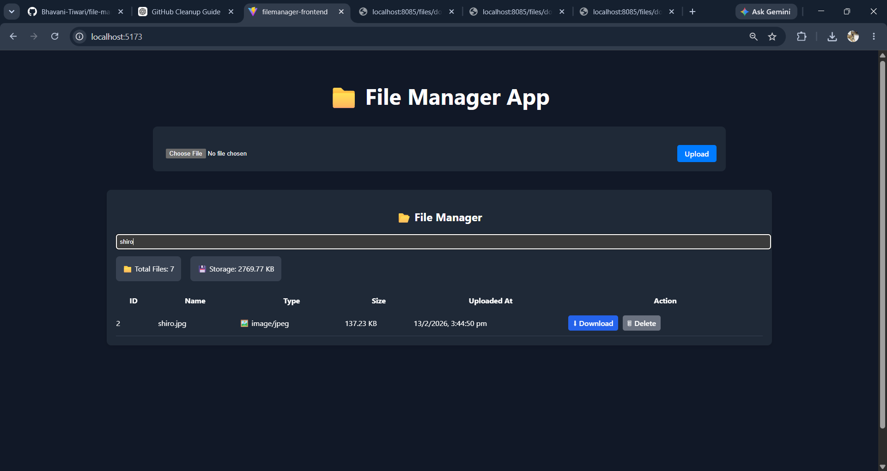

# File Manager App 📁

A full-stack file management application built using React and Spring Boot. The application allows users to upload, search, view, and manage files through a simple and user-friendly interface.

##  Features

* Upload files
* View uploaded files
* Search files
* Download files
* Responsive user interface
* Backend API integration

##  Technologies Used

### Frontend

* React
* Vite
* JavaScript
* HTML
* CSS

### Backend

* Spring Boot
* Java
* Maven
* MySQL

##  Project Structure

```text
file-manager-app
│
├── filemanager/
│   └── Spring Boot Backend
│
└── filemanager-frontend/
    └── React Frontend
```

##  Running the Project

### Backend

```bash
cd filemanager
mvn spring-boot:run
```

### Frontend

```bash
cd filemanager-frontend
npm install
npm run dev
```
## Screenshots

### Dashboard



### File Upload



### Search Feature



##  Learning Outcomes

* Full Stack Development
* REST API Integration
* File Handling
* React Components
* Spring Boot Development
* Database Connectivity

##  Author

Bhavani Tiwari

Java Full Stack Developer passionate about building practical applications and continuously improving software development skills.
